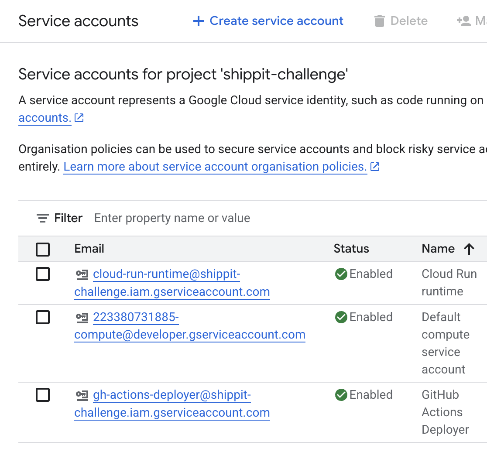

# Assumptions
- Current go code doesn't need any change.
- Setup only for a dev environment, that is, more work needs to be done for QA and PROD environments (mainly the terraform code). For example, there is no env setting.

# Notes
- Setup as simple as possible to while still getting the objective done.
- For simplicity reasons I've set this to run terraform locally only. In real world scenario I'd use cloud terraform or a cloud storage solution to store the state file, and a pipeline will run terraform instead.
- when running TF plan you will need to provide:
    - GitHub repository in the form OWNER/REPO: in my case "andycpu/shippit-challenge"
    - GCP project ID: in my case: "shippit-challenge"
- Terraform will fail to create the cloud run service. In reality, the service should be created. But it will fail to start as there is no image yet. This is something to be improved of course. 

# Prerequisites (GCP and Github)
- create an account in GCP
- create a project in GCP
- download gcloud cli
- Ensure you’re logged in with rights to enable APIs and create IAM. Run:
    - gcloud auth application-default login
    - gcloud config set project [YOUR_GCP_PROJECT_ID]
- fork or clone the repo [shippit-challenge](https://github.com/andycpu/shippit-challenge)
    - Ideally DO NOT push to main yet. This is to avoid kicking off the pipeline now (it will fail as we have not run terraform yet)
- run terraform locally to spin up the cloud run service and all its dependencies (SA, IAM permissions, etc) in GCP. Run:
    - "cd infra"
    - "terraform init"
    - "terraform plan" (optional) - you will need to provide your github repo name in the format OWNER/REPO_NAME, and the GCP project ID
    - "terraform apply" - you will need to provide your github repo name in the format OWNER/REPO_NAME, and the GCP project ID. You are expected to see something like this:
`
╷
│ Error: Error waiting to create Service: resource is in failed state "Ready:False", message: Revision 'webapp-00001-x6w' is not ready and cannot serve traffic. Image 'asia-southeast2-docker.pkg.dev/shippit-challenge/app/shippit:latest' not found.
│ 
│   with google_cloud_run_service.service,
│   on main.tf line 77, in resource "google_cloud_run_service" "service":
│   77: resource "google_cloud_run_service" "service" {
`

- in your new github repo, add these repository variables with their respective values (go to settings, secrets and variables, actions):
    - GCP_PROJECT_ID (this youn find in the GCP console of your project)
    - GCP_WORKLOAD_IDENTITY_PROVIDER (you can get its value by running this command "terraform output -raw workload_identity_provider_name". It should look like this: projects/81273812738712/locations/global/workloadIdentityPools/github-actions/providers/github)
- once this is done, you can push your changes to main branch in your repo. This should trigger the ci/cd pipeline (as GitHub action) which will do the following:
    - build the docker image
    - push it to artifactory
    - deploy the image to cloud run

# Screenshots
I have created a new repo and a new GCP project to verify that you should be able to reproduce these steps. But just in case, here some screenshots:

Service accounts in GCP

Artifactory:

Cloud Run:
As you can see the failed one is the service we attempted to create from terraform. The successful one was deployed from GitHub (with a proper service account).

App running live. Yes, you are welcome to test it.

CI CD pipeline

